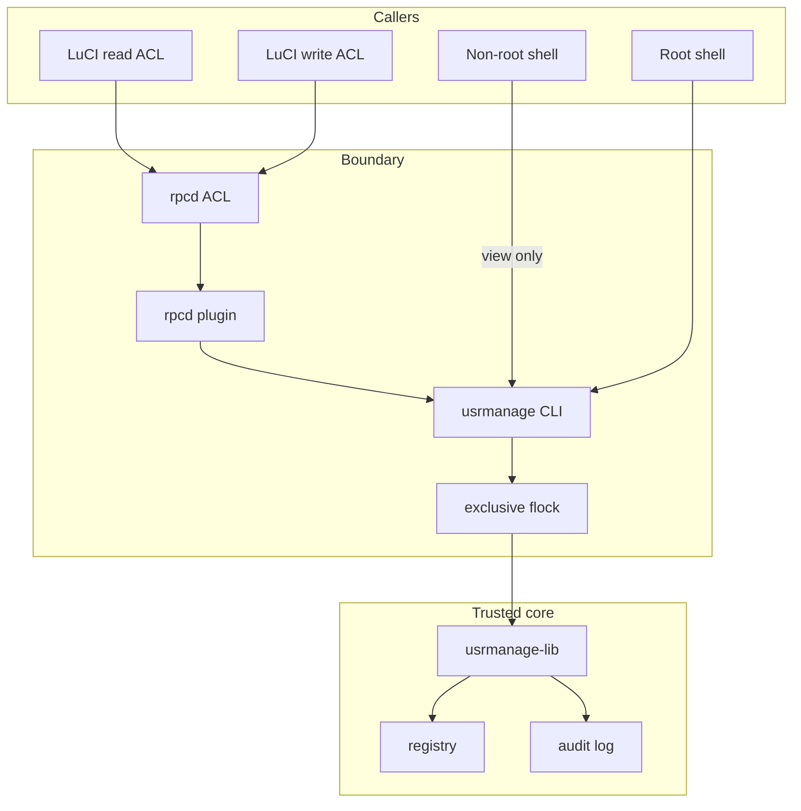

# Architecture

Usrmanage manages **local UNIX accounts** on OpenWrt without RADIUS/LDAP. One shared CLI implements mutations; LuCI reaches it only through rpcd.

## Components

| Piece | Path | Role |
|-------|------|------|
| CLI | `/usr/sbin/usrmanage` | Operator + rpcd entrypoint |
| Library | `/usr/lib/usrmanage/usrmanage-lib.sh` | Validation, registry, audit, lock, account tools |
| Registry | `/etc/usrmanage/users` | Managed-user set |
| Sudoers | `/etc/sudoers.d/usrmanage` | `%wheel` → full sudo (password required) |
| Audit | `/var/log/usrmanage/audit.log` + syslog tag `usrmanage` | Operational events |
| rpcd | `/usr/libexec/rpcd/usrmanage` | ubus object `usrmanage` |
| LuCI view | `view/system/usrmanage` | System → User Management |

## Privilege boundary

## Roles

| Role | UNIX | App access |
|------|------|------------|
| readonly | UID ≥ 1000, not in `wheel` | View list + audit (LuCI read ACL / non-root CLI) |
| admin | in `wheel` + sudo | Full manage (LuCI write ACL / root CLI) |

**Admin = full root via sudo** by design (`%wheel ALL=(ALL:ALL) ALL`, no NOPASSWD).

## Managed set

Only users listed in the registry are managed. Mutators refuse unmanaged targets. Last-admin protection counts **managed** users currently in `wheel`.

## Removal sequence

1. Policy checks (managed, not last admin, not system)
2. Lock account
3. Terminate user processes (best-effort)
4. Remove from `wheel`
5. Delete account (`userdel`; home kept unless `--purge-home`)
6. Registry update
7. Audit `remove` / `fail` / `denied`

## Passwords

- CLI: TTY or `--password-fd` (never argv)
- LuCI: password may traverse ubus JSON once → rpcd pipes to CLI `--password-fd 0`
- Never written to audit/syslog/errors
- Hardened deployments: HTTPS for LuCI (see [security.md](../security.md))

## Related

- [CLI and API](cli-and-api.md)
- [Threat model](../threat-model.md)
- [Security](../security.md)
- [Security audit ledger](../security-review.md)
